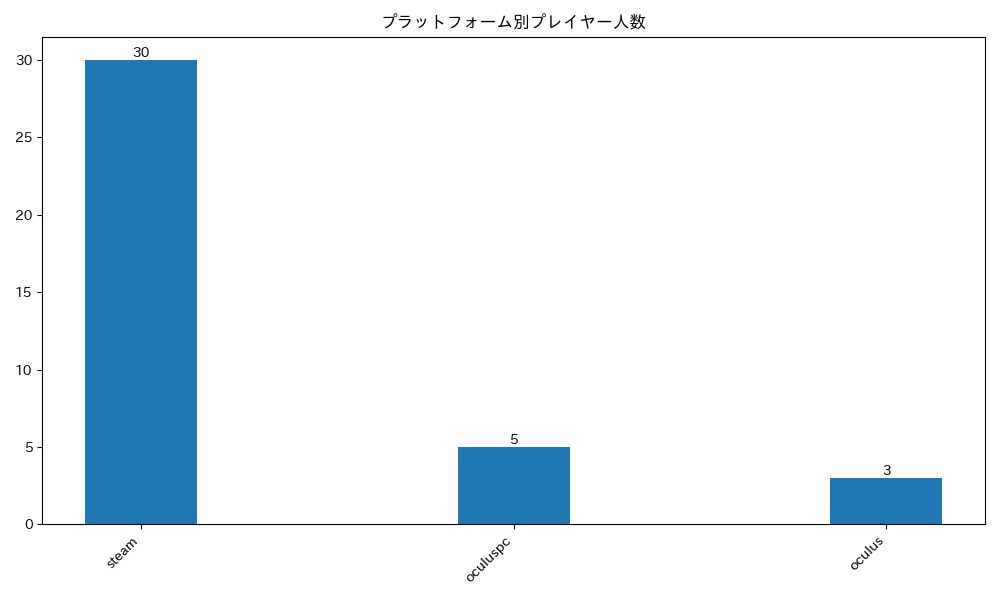
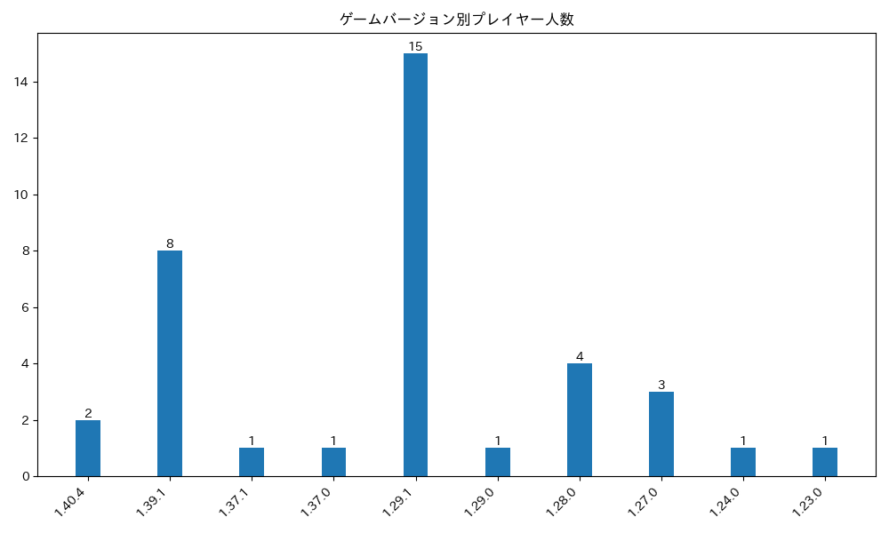
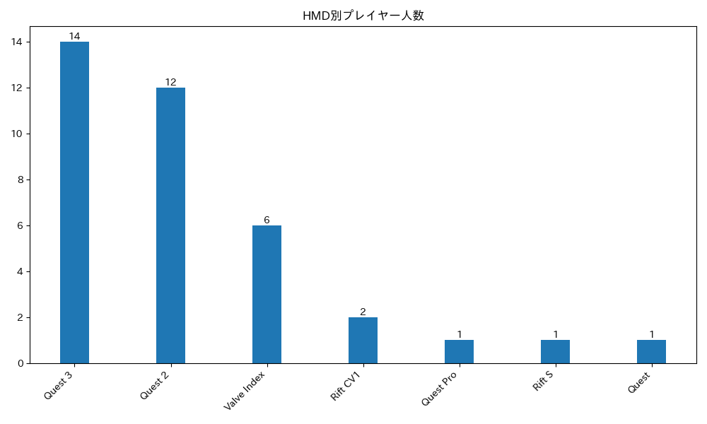
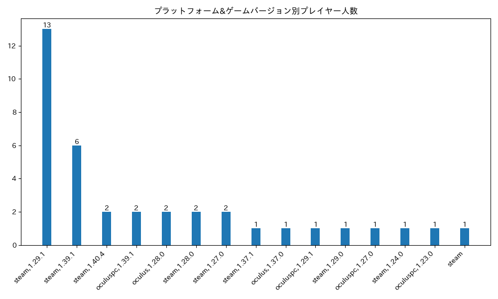

# player_count_by_bs_version

[このポスト](https://x.com/ge2toro/status/1921944149143482563)にインスパイアを受けて作成しました。  
現時点では日本で登録している人を対象に集計しています。  
ただし、BeatLeaderのModを更新していないプレイヤー(BeatLeaderのサイト上でグローバルランクが`#0`となっていたり合計ppが`0pp`になっているプレイヤー。以下「未更新プレイヤー」とします。)の統計は取得できていません。

## プレイヤーのゲームバージョン統計結果
過去1ヶ月以内にプレイがあり、BeatLeaderのModを導入している、BeatLeaderのランク上位1088人の日本で登録しているプレイヤーが対象

### プラットフォームのみ
| プラットフォーム | 人数 | 割合 |
| ---- | ---- | ---- |
| steam | 865 | 79.5% |
| oculus | 184 | 16.91% |
| oculuspc | 39 | 3.58% |

### ゲームバージョンのみ
| バージョン | 人数 | 割合 |
| ---- | ---- | ---- |
| 1.40.8 | 70 | 6.43% |
| 1.40.7 | 12 | 1.1% |
| 1.40.6 | 29 | 2.67% |
| 1.40.5 | 18 | 1.65% |
| 1.40.4 | 34 | 3.12% |
| 1.40.3 | 2 | 0.18% |
| 1.40.0 | 1 | 0.09% |
| 1.39.1 | 114 | 10.48% |
| 1.39.0 | 3 | 0.28% |
| 1.38.0 | 8 | 0.74% |
| 1.37.3 | 1 | 0.09% |
| 1.37.2 | 1 | 0.09% |
| 1.37.1 | 44 | 4.04% |
| 1.37.0 | 114 | 10.48% |
| 1.36.2 | 4 | 0.37% |
| 1.36.0 | 1 | 0.09% |
| 1.35.0 | 4 | 0.37% |
| 1.34.3 | 1 | 0.09% |
| 1.34.2 | 38 | 3.49% |
| 1.34.0 | 1 | 0.09% |
| 1.31.1 | 5 | 0.46% |
| 1.29.1 | 386 | 35.48% |
| 1.29.0 | 33 | 3.03% |
| 1.28.0 | 76 | 6.99% |
| 1.27.0 | 36 | 3.31% |
| 1.26.0 | 6 | 0.55% |
| 1.25.1 | 13 | 1.19% |
| 1.25.0 | 1 | 0.09% |
| 1.24.1 | 9 | 0.83% |
| 1.24.0 | 8 | 0.74% |
| 1.23.0 | 5 | 0.46% |
| 1.22.0 | 2 | 0.18% |
| 1.21.0 | 3 | 0.28% |
| 1.17.1 | 2 | 0.18% |

### HMD
| HMD | 人数 | 割合 |
| ---- | ---- | ---- |
| Quest 3 | 407 | 37.41% |
| Quest 2 | 374 | 34.38% |
| Valve Index | 77 | 7.08% |
| Quest 3S | 73 | 6.71% |
| Vive Pro | 28 | 2.57% |
| Vive | 26 | 2.39% |
| Rift S | 19 | 1.75% |
| Rift CV1 | 17 | 1.56% |
| Pico 4 | 17 | 1.56% |
| Quest | 12 | 1.1% |
| Vive Pro 2 | 10 | 0.92% |
| Unknown headset | 7 | 0.64% |
| Quest Pro | 5 | 0.46% |
| Bigscreen Beyond | 5 | 0.46% |
| Vive Elite | 4 | 0.37% |
| PS VR2 | 3 | 0.28% |
| Windows Mixed Reality | 2 | 0.18% |
| Pico Neo 3 | 2 | 0.18% |

### プラットフォームとゲームバージョンの両方
| プラットフォームとバージョン | 人数 | 割合 |
| ---- | ---- | ---- |
| steam,1.29.1 | 377 | 34.65% |
| steam,1.39.1 | 105 | 9.65% |
| oculus,1.37.0 | 105 | 9.65% |
| steam,1.40.8 | 57 | 5.24% |
| oculus,1.28.0 | 44 | 4.04% |
| steam,1.37.1 | 42 | 3.86% |
| steam,1.34.2 | 35 | 3.22% |
| steam,1.27.0 | 35 | 3.22% |
| steam,1.29.0 | 32 | 2.94% |
| steam,1.28.0 | 32 | 2.94% |
| steam,1.40.4 | 24 | 2.21% |
| steam,1.40.6 | 20 | 1.84% |
| steam,1.40.5 | 17 | 1.56% |
| oculus,1.40.8 | 10 | 0.92% |
| steam,1.40.7 | 10 | 0.92% |
| oculuspc,1.39.1 | 9 | 0.83% |
| steam,1.37.0 | 9 | 0.83% |
| oculuspc,1.29.1 | 9 | 0.83% |
| steam,1.24.1 | 9 | 0.83% |
| oculus,1.40.6 | 8 | 0.74% |
| steam,1.25.1 | 8 | 0.74% |
| steam,1.38.0 | 7 | 0.64% |
| steam,1.24.0 | 7 | 0.64% |
| steam,1.26.0 | 6 | 0.55% |
| oculuspc,1.40.4 | 5 | 0.46% |
| oculus,1.40.4 | 5 | 0.46% |
| steam,1.31.1 | 5 | 0.46% |
| oculus,1.25.1 | 5 | 0.46% |
| steam,1.36.2 | 4 | 0.37% |
| steam,1.23.0 | 4 | 0.37% |
| oculuspc,1.40.8 | 3 | 0.28% |
| oculuspc,1.34.2 | 3 | 0.28% |
| steam,1.21.0 | 3 | 0.28% |
| oculus,1.40.7 | 2 | 0.18% |
| steam,1.40.3 | 2 | 0.18% |
| steam,1.39.0 | 2 | 0.18% |
| oculuspc,1.37.1 | 2 | 0.18% |
| steam,1.35.0 | 2 | 0.18% |
| steam,1.22.0 | 2 | 0.18% |
| oculus,1.17.1 | 2 | 0.18% |
| steam | 2 | 0.18% |
| oculuspc,1.40.6 | 1 | 0.09% |
| oculuspc,1.40.5 | 1 | 0.09% |
| steam,1.40.0 | 1 | 0.09% |
| oculuspc,1.39.0 | 1 | 0.09% |
| oculuspc,1.38.0 | 1 | 0.09% |
| steam,1.37.3 | 1 | 0.09% |
| steam,1.37.2 | 1 | 0.09% |
| steam,1.36.0 | 1 | 0.09% |
| oculus,1.35.0 | 1 | 0.09% |
| oculuspc,1.35.0 | 1 | 0.09% |
| steam,1.34.3 | 1 | 0.09% |
| steam,1.34.0 | 1 | 0.09% |
| oculuspc,1.29.0 | 1 | 0.09% |
| oculuspc,1.27.0 | 1 | 0.09% |
| steam,1.25.0 | 1 | 0.09% |
| oculus,1.24.0 | 1 | 0.09% |
| oculuspc,1.23.0 | 1 | 0.09% |
| oculus | 1 | 0.09% |

