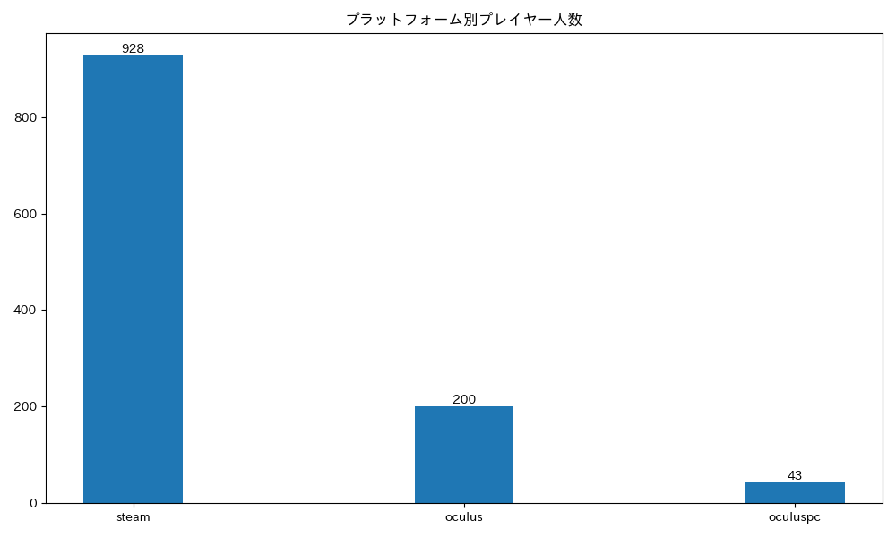
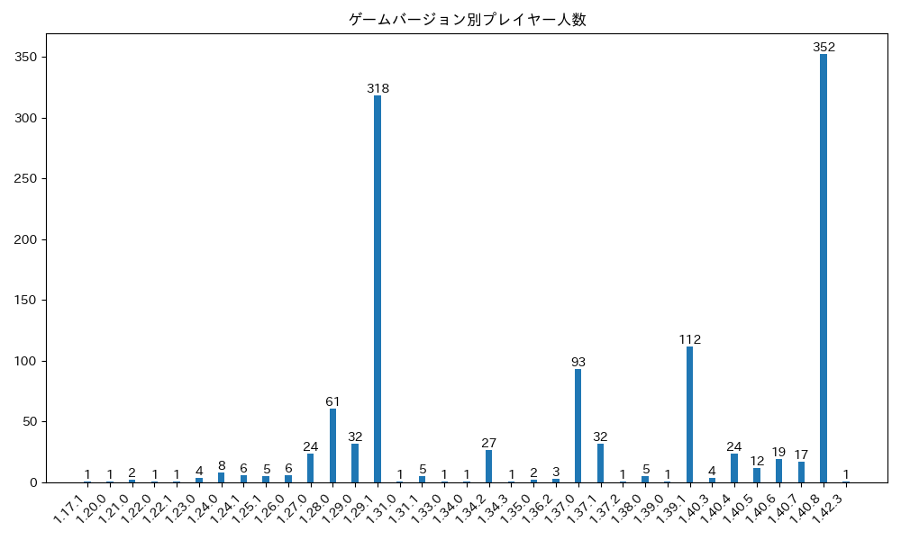
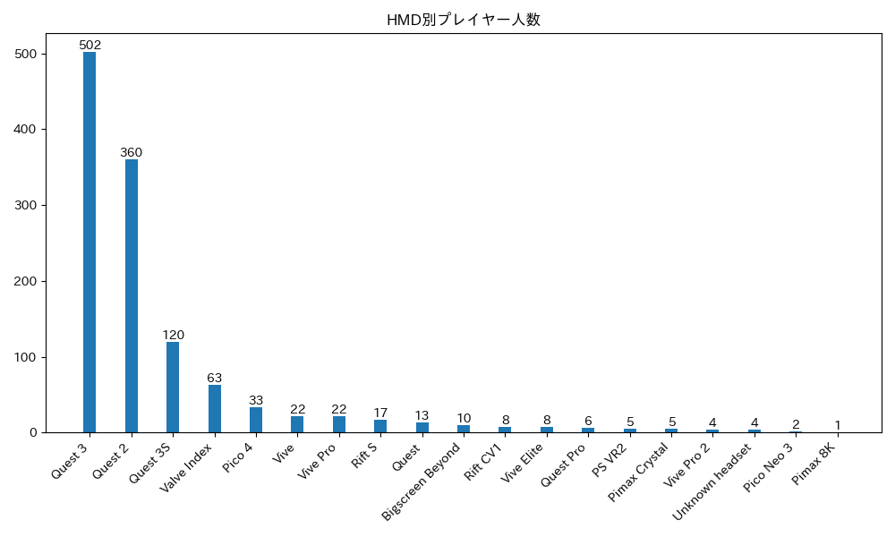
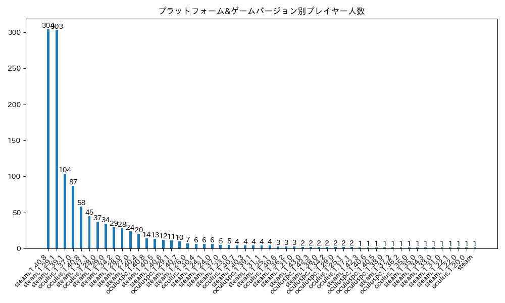

# player_count_by_bs_version

[このポスト](https://x.com/ge2toro/status/1921944149143482563)にインスパイアを受けて作成しました。  
現時点では日本で登録している人を対象に集計しています。  
ただし、BeatLeaderのModを更新していないプレイヤー(BeatLeaderのサイト上でグローバルランクが`#0`となっていたり合計ppが`0pp`になっているプレイヤー。以下「未更新プレイヤー」とします。)の統計は取得できていません。

## プレイヤーのゲームバージョン統計結果
過去1ヶ月以内にプレイがあり、BeatLeaderのModを導入している、BeatLeaderのランク上位38人の日本で登録しているプレイヤーが対象

### プラットフォームのみ
| プラットフォーム | 人数 | 割合 |
| ---- | ---- | ---- |
| steam | 30 | 78.95% |
| oculuspc | 5 | 13.16% |
| oculus | 3 | 7.89% |

### ゲームバージョンのみ
| バージョン | 人数 | 割合 |
| ---- | ---- | ---- |
| 1.40.4 | 2 | 5.26% |
| 1.39.1 | 8 | 21.05% |
| 1.37.1 | 1 | 2.63% |
| 1.37.0 | 1 | 2.63% |
| 1.29.1 | 15 | 39.47% |
| 1.29.0 | 1 | 2.63% |
| 1.28.0 | 4 | 10.53% |
| 1.27.0 | 3 | 7.89% |
| 1.24.0 | 1 | 2.63% |
| 1.23.0 | 1 | 2.63% |

### HMD
| HMD | 人数 | 割合 |
| ---- | ---- | ---- |
| Quest 3 | 15 | 39.47% |
| Quest 2 | 12 | 31.58% |
| Valve Index | 6 | 15.79% |
| Rift CV1 | 2 | 5.26% |
| Quest Pro | 1 | 2.63% |
| Rift S | 1 | 2.63% |
| Quest | 1 | 2.63% |

### プラットフォームとゲームバージョンの両方
| プラットフォームとバージョン | 人数 | 割合 |
| ---- | ---- | ---- |
| steam,1.29.1 | 14 | 36.84% |
| steam,1.39.1 | 6 | 15.79% |
| steam,1.40.4 | 2 | 5.26% |
| oculuspc,1.39.1 | 2 | 5.26% |
| oculus,1.28.0 | 2 | 5.26% |
| steam,1.28.0 | 2 | 5.26% |
| steam,1.27.0 | 2 | 5.26% |
| steam,1.37.1 | 1 | 2.63% |
| oculus,1.37.0 | 1 | 2.63% |
| oculuspc,1.29.1 | 1 | 2.63% |
| steam,1.29.0 | 1 | 2.63% |
| oculuspc,1.27.0 | 1 | 2.63% |
| steam,1.24.0 | 1 | 2.63% |
| oculuspc,1.23.0 | 1 | 2.63% |
| steam | 1 | 2.63% |

