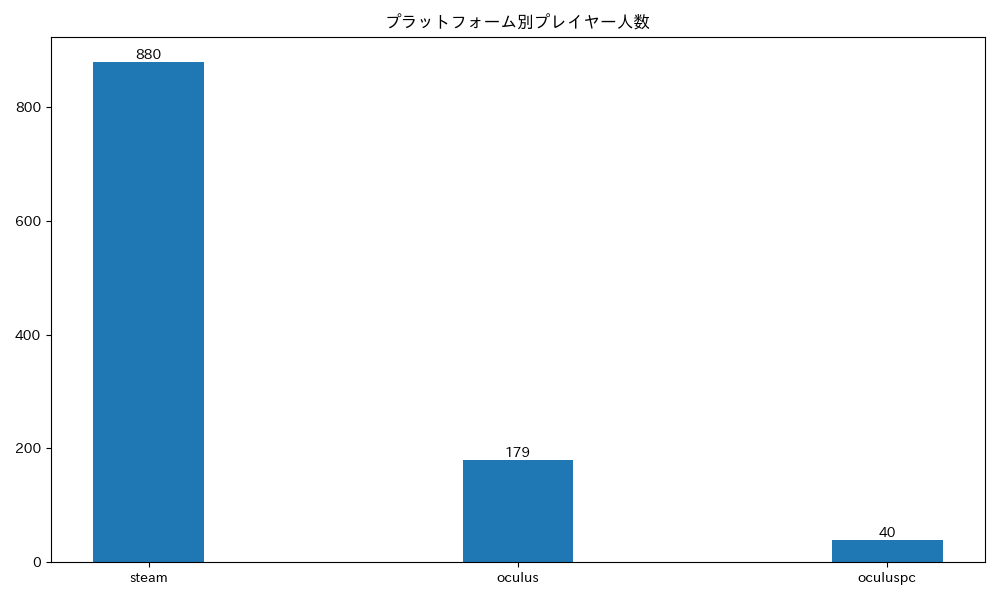
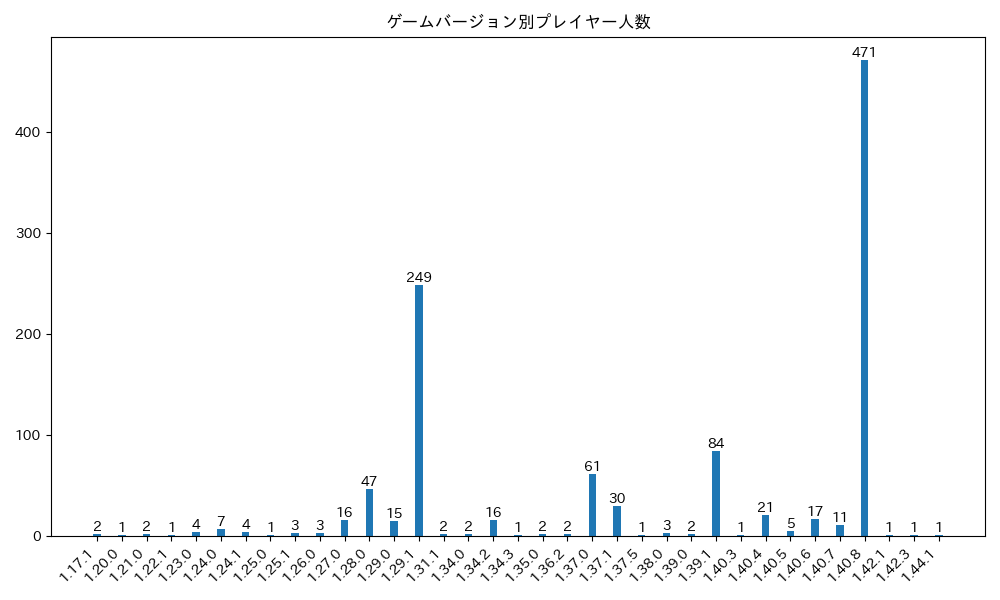
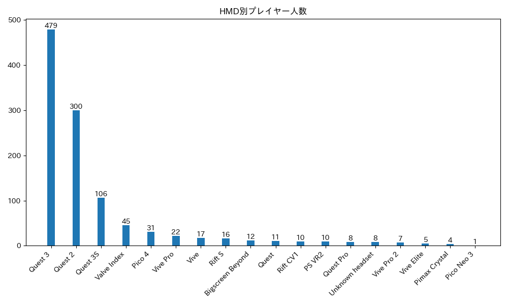
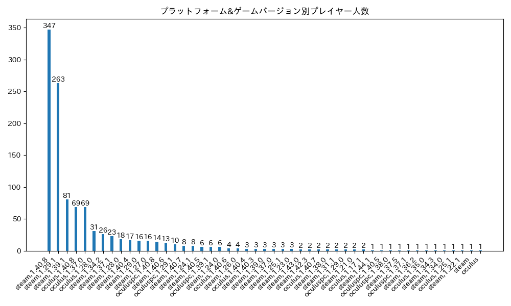

# player_count_by_bs_version

[このポスト](https://x.com/ge2toro/status/1921944149143482563)にインスパイアを受けて作成しました。  
現時点では日本で登録している人を対象に集計しています。  
> [!WARNING]
> BeatLeaderのModを更新していないプレイヤー(BeatLeaderのサイト上でグローバルランクが`#0`となっていたり合計ppが`0pp`になっているプレイヤー。以下「未更新プレイヤー」とします。)の統計は取得できていません。

> [!NOTE]
> 2025年10月15日以降の更新分の集計結果については、gitでバージョン管理されたこのREADMEだけでなく、 https://github.com/rakkyo150/player_count_by_bs_version/blob/master/data/history.json にも保存するようにしました。

## プレイヤーのゲームバージョン統計結果
未更新プレイヤーは0人いました。  
過去1ヶ月以内にプレイがあり、BeatLeaderのModを導入している、未更新プレイヤーを除いた、BeatLeaderに日本で登録しているプレイヤーである1092人が対象。

### プラットフォームのみ
| プラットフォーム | 人数 | 割合 |
| ---- | ---- | ---- |
| steam | 846 | 77.47% |
| oculus | 199 | 18.22% |
| oculuspc | 47 | 4.3% |

### ゲームバージョンのみ
| バージョン | 人数 | 割合 |
| ---- | ---- | ---- |
| 1.44.1 | 1 | 0.09% |
| 1.43.0 | 1 | 0.09% |
| 1.41.1 | 1 | 0.09% |
| 1.40.8 | 458 | 41.94% |
| 1.40.7 | 14 | 1.28% |
| 1.40.6 | 17 | 1.56% |
| 1.40.5 | 4 | 0.37% |
| 1.40.4 | 20 | 1.83% |
| 1.40.3 | 1 | 0.09% |
| 1.39.1 | 84 | 7.69% |
| 1.39.0 | 2 | 0.18% |
| 1.38.0 | 3 | 0.27% |
| 1.37.1 | 32 | 2.93% |
| 1.37.0 | 60 | 5.49% |
| 1.36.2 | 3 | 0.27% |
| 1.35.0 | 2 | 0.18% |
| 1.34.3 | 1 | 0.09% |
| 1.34.2 | 14 | 1.28% |
| 1.34.0 | 2 | 0.18% |
| 1.31.1 | 2 | 0.18% |
| 1.29.1 | 254 | 23.26% |
| 1.29.0 | 18 | 1.65% |
| 1.28.0 | 47 | 4.3% |
| 1.27.0 | 17 | 1.56% |
| 1.26.0 | 5 | 0.46% |
| 1.25.1 | 6 | 0.55% |
| 1.25.0 | 1 | 0.09% |
| 1.24.1 | 4 | 0.37% |
| 1.24.0 | 7 | 0.64% |
| 1.23.0 | 4 | 0.37% |
| 1.22.1 | 1 | 0.09% |
| 1.21.0 | 2 | 0.18% |
| 1.20.0 | 1 | 0.09% |
| 1.17.1 | 2 | 0.18% |

### HMD
| HMD | 人数 | 割合 |
| ---- | ---- | ---- |
| Quest 3 | 479 | 43.86% |
| Quest 2 | 300 | 27.47% |
| Quest 3S | 106 | 9.71% |
| Valve Index | 45 | 4.12% |
| Pico 4 | 31 | 2.84% |
| Vive Pro | 22 | 2.01% |
| Vive | 17 | 1.56% |
| Rift S | 16 | 1.47% |
| Bigscreen Beyond | 12 | 1.1% |
| Quest | 11 | 1.01% |
| Rift CV1 | 10 | 0.92% |
| PS VR2 | 10 | 0.92% |
| Quest Pro | 8 | 0.73% |
| Unknown headset | 8 | 0.73% |
| Vive Pro 2 | 7 | 0.64% |
| Vive Elite | 5 | 0.46% |
| Pimax Crystal | 4 | 0.37% |
| Pico Neo 3 | 1 | 0.09% |

### プラットフォームとゲームバージョンの両方
| プラットフォームとバージョン | 人数 | 割合 |
| ---- | ---- | ---- |
| steam,1.40.8 | 335 | 30.68% |
| steam,1.29.1 | 247 | 22.62% |
| oculus,1.40.8 | 94 | 8.61% |
| steam,1.39.1 | 79 | 7.23% |
| oculus,1.37.0 | 58 | 5.31% |
| steam,1.37.1 | 31 | 2.84% |
| oculus,1.28.0 | 31 | 2.84% |
| oculuspc,1.40.8 | 29 | 2.66% |
| steam,1.40.4 | 18 | 1.65% |
| steam,1.29.0 | 16 | 1.47% |
| steam,1.28.0 | 16 | 1.47% |
| steam,1.27.0 | 16 | 1.47% |
| steam,1.34.2 | 14 | 1.28% |
| steam,1.40.6 | 13 | 1.19% |
| steam,1.40.7 | 10 | 0.92% |
| oculuspc,1.29.1 | 7 | 0.64% |
| steam,1.24.0 | 7 | 0.64% |
| oculuspc,1.39.1 | 5 | 0.46% |
| steam,1.26.0 | 5 | 0.46% |
| steam,1.25.1 | 5 | 0.46% |
| oculus,1.40.7 | 4 | 0.37% |
| steam,1.40.5 | 4 | 0.37% |
| steam,1.24.1 | 4 | 0.37% |
| steam,1.23.0 | 4 | 0.37% |
| oculus,1.40.6 | 3 | 0.27% |
| oculus,1.40.4 | 2 | 0.18% |
| steam,1.39.0 | 2 | 0.18% |
| steam,1.38.0 | 2 | 0.18% |
| steam,1.37.0 | 2 | 0.18% |
| steam,1.36.2 | 2 | 0.18% |
| steam,1.34.0 | 2 | 0.18% |
| steam,1.31.1 | 2 | 0.18% |
| oculuspc,1.29.0 | 2 | 0.18% |
| steam,1.21.0 | 2 | 0.18% |
| oculus,1.17.1 | 2 | 0.18% |
| steam,1.44.1 | 1 | 0.09% |
| steam,1.43.0 | 1 | 0.09% |
| steam,1.41.1 | 1 | 0.09% |
| oculuspc,1.40.6 | 1 | 0.09% |
| steam,1.40.3 | 1 | 0.09% |
| oculuspc,1.38.0 | 1 | 0.09% |
| oculuspc,1.37.1 | 1 | 0.09% |
| oculuspc,1.36.2 | 1 | 0.09% |
| oculus,1.35.0 | 1 | 0.09% |
| steam,1.35.0 | 1 | 0.09% |
| steam,1.34.3 | 1 | 0.09% |
| oculus,1.27.0 | 1 | 0.09% |
| oculus,1.25.1 | 1 | 0.09% |
| steam,1.25.0 | 1 | 0.09% |
| steam,1.22.1 | 1 | 0.09% |
| oculus,1.20.0 | 1 | 0.09% |
| oculus | 1 | 0.09% |

