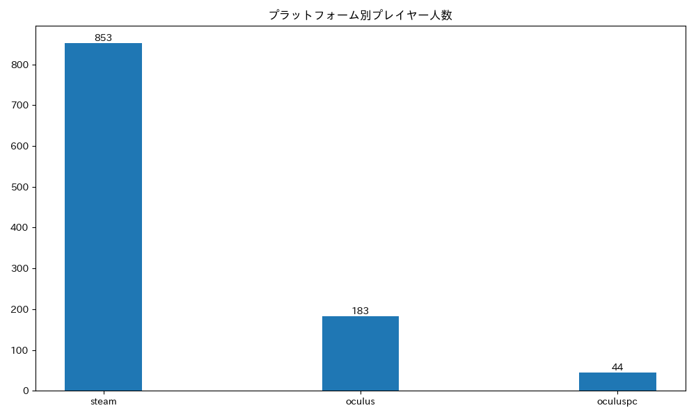
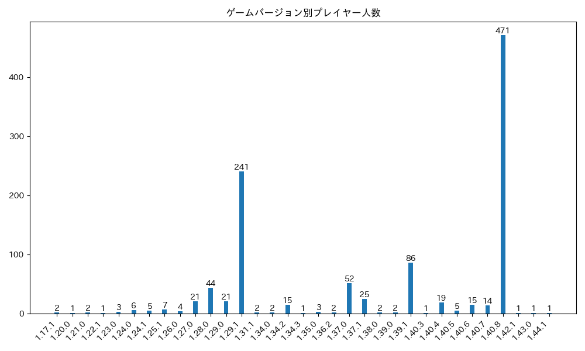
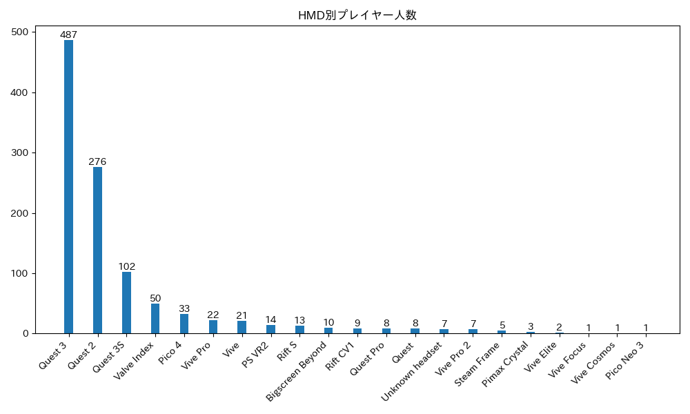
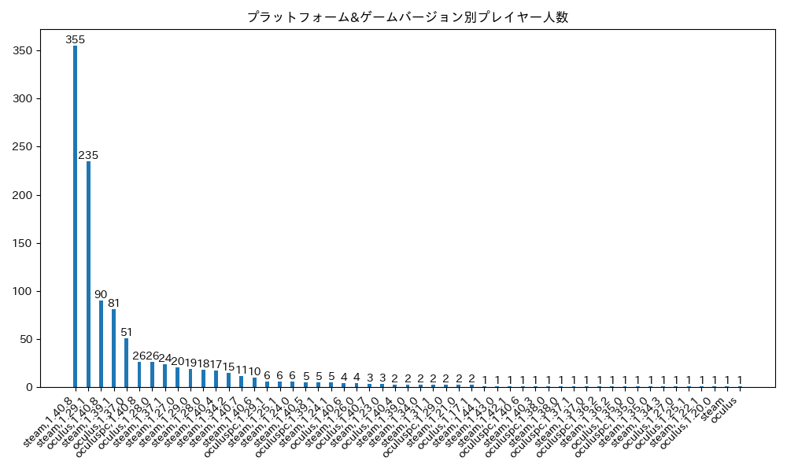

# player_count_by_bs_version

[このポスト](https://x.com/ge2toro/status/1921944149143482563)にインスパイアを受けて作成しました。  
現時点では日本で登録している人を対象に集計しています。  
> [!WARNING]
> BeatLeaderのModを更新していないプレイヤー(BeatLeaderのサイト上でグローバルランクが`#0`となっていたり合計ppが`0pp`になっているプレイヤー。以下「未更新プレイヤー」とします。)の統計は取得できていません。

> [!NOTE]
> 2025年10月15日以降の更新分の集計結果については、gitでバージョン管理されたこのREADMEだけでなく、 https://github.com/rakkyo150/player_count_by_bs_version/blob/master/data/history.json にも保存するようにしました。

## プレイヤーのゲームバージョン統計結果
未更新プレイヤーは0人いました。  
過去1ヶ月以内にプレイがあり、BeatLeaderのModを導入している、未更新プレイヤーを除いた、BeatLeaderに日本で登録しているプレイヤーである1080人が対象。

### プラットフォームのみ
| プラットフォーム | 人数 | 割合 |
| ---- | ---- | ---- |
| steam | 853 | 78.98% |
| oculus | 183 | 16.94% |
| oculuspc | 44 | 4.07% |

### ゲームバージョンのみ
| バージョン | 人数 | 割合 |
| ---- | ---- | ---- |
| 1.44.1 | 1 | 0.09% |
| 1.43.0 | 1 | 0.09% |
| 1.42.1 | 1 | 0.09% |
| 1.40.8 | 471 | 43.61% |
| 1.40.7 | 14 | 1.3% |
| 1.40.6 | 15 | 1.39% |
| 1.40.5 | 5 | 0.46% |
| 1.40.4 | 19 | 1.76% |
| 1.40.3 | 1 | 0.09% |
| 1.39.1 | 86 | 7.96% |
| 1.39.0 | 2 | 0.19% |
| 1.38.0 | 2 | 0.19% |
| 1.37.1 | 25 | 2.31% |
| 1.37.0 | 52 | 4.81% |
| 1.36.2 | 2 | 0.19% |
| 1.35.0 | 3 | 0.28% |
| 1.34.3 | 1 | 0.09% |
| 1.34.2 | 15 | 1.39% |
| 1.34.0 | 2 | 0.19% |
| 1.31.1 | 2 | 0.19% |
| 1.29.1 | 241 | 22.31% |
| 1.29.0 | 21 | 1.94% |
| 1.28.0 | 44 | 4.07% |
| 1.27.0 | 21 | 1.94% |
| 1.26.0 | 4 | 0.37% |
| 1.25.1 | 7 | 0.65% |
| 1.24.1 | 5 | 0.46% |
| 1.24.0 | 6 | 0.56% |
| 1.23.0 | 3 | 0.28% |
| 1.22.1 | 1 | 0.09% |
| 1.21.0 | 2 | 0.19% |
| 1.20.0 | 1 | 0.09% |
| 1.17.1 | 2 | 0.19% |

### HMD
| HMD | 人数 | 割合 |
| ---- | ---- | ---- |
| Quest 3 | 487 | 45.09% |
| Quest 2 | 276 | 25.56% |
| Quest 3S | 102 | 9.44% |
| Valve Index | 50 | 4.63% |
| Pico 4 | 33 | 3.06% |
| Vive Pro | 22 | 2.04% |
| Vive | 21 | 1.94% |
| PS VR2 | 14 | 1.3% |
| Rift S | 13 | 1.2% |
| Bigscreen Beyond | 10 | 0.93% |
| Rift CV1 | 9 | 0.83% |
| Quest Pro | 8 | 0.74% |
| Quest | 8 | 0.74% |
| Unknown headset | 7 | 0.65% |
| Vive Pro 2 | 7 | 0.65% |
| Steam Frame | 5 | 0.46% |
| Pimax Crystal | 3 | 0.28% |
| Vive Elite | 2 | 0.19% |
| Vive Focus | 1 | 0.09% |
| Vive Cosmos | 1 | 0.09% |
| Pico Neo 3 | 1 | 0.09% |

### プラットフォームとゲームバージョンの両方
| プラットフォームとバージョン | 人数 | 割合 |
| ---- | ---- | ---- |
| steam,1.40.8 | 355 | 32.87% |
| steam,1.29.1 | 235 | 21.76% |
| oculus,1.40.8 | 90 | 8.33% |
| steam,1.39.1 | 81 | 7.5% |
| oculus,1.37.0 | 51 | 4.72% |
| oculuspc,1.40.8 | 26 | 2.41% |
| oculus,1.28.0 | 26 | 2.41% |
| steam,1.37.1 | 24 | 2.22% |
| steam,1.27.0 | 20 | 1.85% |
| steam,1.29.0 | 19 | 1.76% |
| steam,1.28.0 | 18 | 1.67% |
| steam,1.40.4 | 17 | 1.57% |
| steam,1.34.2 | 15 | 1.39% |
| steam,1.40.7 | 11 | 1.02% |
| steam,1.40.6 | 10 | 0.93% |
| oculuspc,1.29.1 | 6 | 0.56% |
| steam,1.25.1 | 6 | 0.56% |
| steam,1.24.0 | 6 | 0.56% |
| steam,1.40.5 | 5 | 0.46% |
| oculuspc,1.39.1 | 5 | 0.46% |
| steam,1.24.1 | 5 | 0.46% |
| oculus,1.40.6 | 4 | 0.37% |
| steam,1.26.0 | 4 | 0.37% |
| oculus,1.40.7 | 3 | 0.28% |
| steam,1.23.0 | 3 | 0.28% |
| oculus,1.40.4 | 2 | 0.19% |
| steam,1.39.0 | 2 | 0.19% |
| steam,1.34.0 | 2 | 0.19% |
| steam,1.31.1 | 2 | 0.19% |
| oculuspc,1.29.0 | 2 | 0.19% |
| steam,1.21.0 | 2 | 0.19% |
| oculus,1.17.1 | 2 | 0.19% |
| steam,1.44.1 | 1 | 0.09% |
| steam,1.43.0 | 1 | 0.09% |
| steam,1.42.1 | 1 | 0.09% |
| oculuspc,1.40.6 | 1 | 0.09% |
| steam,1.40.3 | 1 | 0.09% |
| oculuspc,1.38.0 | 1 | 0.09% |
| steam,1.38.0 | 1 | 0.09% |
| oculuspc,1.37.1 | 1 | 0.09% |
| steam,1.37.0 | 1 | 0.09% |
| oculuspc,1.36.2 | 1 | 0.09% |
| steam,1.36.2 | 1 | 0.09% |
| oculus,1.35.0 | 1 | 0.09% |
| oculuspc,1.35.0 | 1 | 0.09% |
| steam,1.35.0 | 1 | 0.09% |
| steam,1.34.3 | 1 | 0.09% |
| oculus,1.27.0 | 1 | 0.09% |
| oculus,1.25.1 | 1 | 0.09% |
| steam,1.22.1 | 1 | 0.09% |
| oculus,1.20.0 | 1 | 0.09% |
| steam | 1 | 0.09% |
| oculus | 1 | 0.09% |

