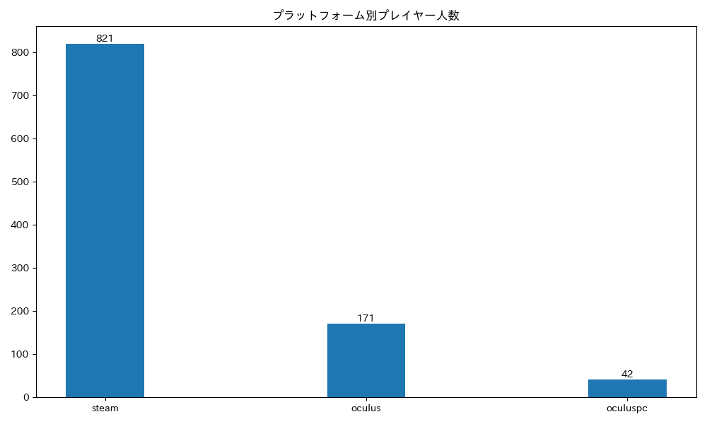
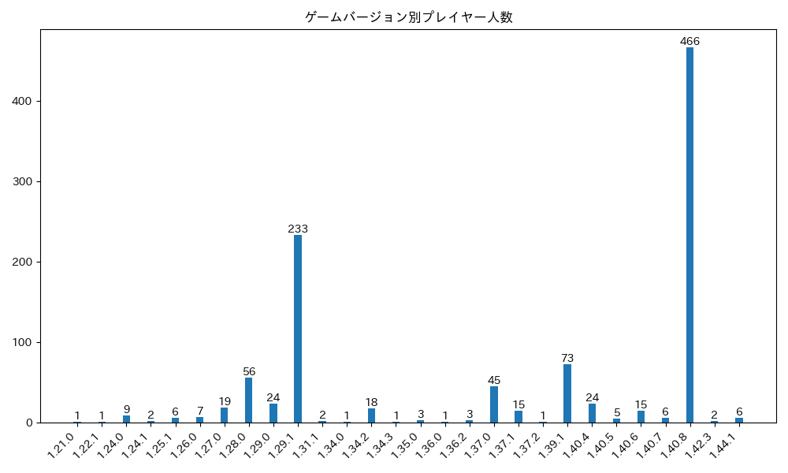
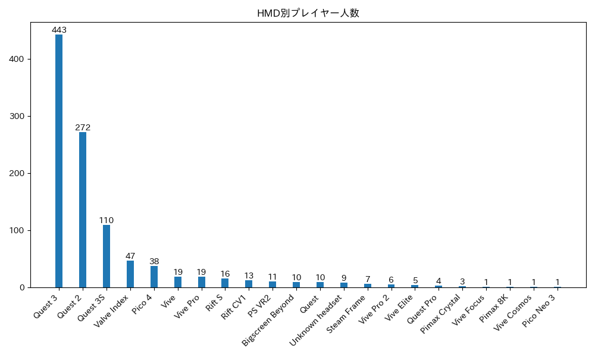
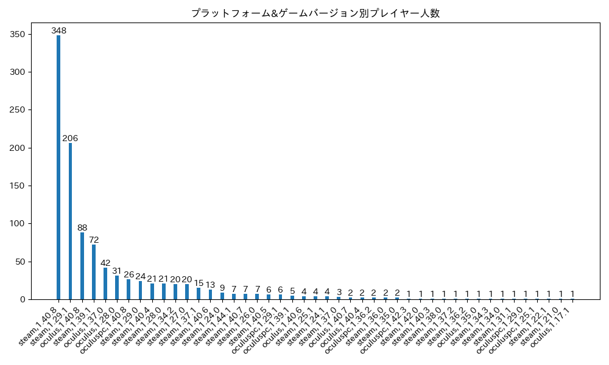

# player_count_by_bs_version

[このポスト](https://x.com/ge2toro/status/1921944149143482563)にインスパイアを受けて作成しました。  
現時点では日本で登録している人を対象に集計しています。  
> [!WARNING]
> BeatLeaderのModを更新していないプレイヤー(BeatLeaderのサイト上でグローバルランクが`#0`となっていたり合計ppが`0pp`になっているプレイヤー。以下「未更新プレイヤー」とします。)の統計は取得できていません。

> [!NOTE]
> 2025年10月15日以降の更新分の集計結果については、gitでバージョン管理されたこのREADMEだけでなく、 https://github.com/rakkyo150/player_count_by_bs_version/blob/master/data/history.json にも保存するようにしました。

## プレイヤーのゲームバージョン統計結果
未更新プレイヤーは0人いました。  
過去1ヶ月以内にプレイがあり、BeatLeaderのModを導入している、未更新プレイヤーを除いた、BeatLeaderに日本で登録しているプレイヤーである1045人が対象。

### プラットフォームのみ
| プラットフォーム | 人数 | 割合 |
| ---- | ---- | ---- |
| steam | 825 | 78.95% |
| oculus | 176 | 16.84% |
| oculuspc | 44 | 4.21% |

### ゲームバージョンのみ
| バージョン | 人数 | 割合 |
| ---- | ---- | ---- |
| 1.44.1 | 6 | 0.57% |
| 1.42.3 | 2 | 0.19% |
| 1.40.8 | 466 | 44.59% |
| 1.40.7 | 6 | 0.57% |
| 1.40.6 | 15 | 1.44% |
| 1.40.5 | 5 | 0.48% |
| 1.40.4 | 24 | 2.3% |
| 1.39.1 | 73 | 6.99% |
| 1.37.2 | 1 | 0.1% |
| 1.37.1 | 15 | 1.44% |
| 1.37.0 | 45 | 4.31% |
| 1.36.2 | 3 | 0.29% |
| 1.36.0 | 1 | 0.1% |
| 1.35.0 | 3 | 0.29% |
| 1.34.3 | 1 | 0.1% |
| 1.34.2 | 18 | 1.72% |
| 1.34.0 | 1 | 0.1% |
| 1.31.1 | 2 | 0.19% |
| 1.29.1 | 233 | 22.3% |
| 1.29.0 | 24 | 2.3% |
| 1.28.0 | 56 | 5.36% |
| 1.27.0 | 19 | 1.82% |
| 1.26.0 | 7 | 0.67% |
| 1.25.1 | 6 | 0.57% |
| 1.24.1 | 2 | 0.19% |
| 1.24.0 | 9 | 0.86% |
| 1.22.1 | 1 | 0.1% |
| 1.21.0 | 1 | 0.1% |

### HMD
| HMD | 人数 | 割合 |
| ---- | ---- | ---- |
| Quest 3 | 443 | 42.39% |
| Quest 2 | 272 | 26.03% |
| Quest 3S | 110 | 10.53% |
| Valve Index | 47 | 4.5% |
| Pico 4 | 38 | 3.64% |
| Vive | 19 | 1.82% |
| Vive Pro | 19 | 1.82% |
| Rift S | 16 | 1.53% |
| Rift CV1 | 13 | 1.24% |
| PS VR2 | 11 | 1.05% |
| Bigscreen Beyond | 10 | 0.96% |
| Quest | 10 | 0.96% |
| Unknown headset | 9 | 0.86% |
| Steam Frame | 7 | 0.67% |
| Vive Pro 2 | 6 | 0.57% |
| Vive Elite | 5 | 0.48% |
| Quest Pro | 4 | 0.38% |
| Pimax Crystal | 3 | 0.29% |
| Vive Focus | 1 | 0.1% |
| Pimax 8K | 1 | 0.1% |
| Vive Cosmos | 1 | 0.1% |
| Pico Neo 3 | 1 | 0.1% |

### プラットフォームとゲームバージョンの両方
| プラットフォームとバージョン | 人数 | 割合 |
| ---- | ---- | ---- |
| steam,1.40.8 | 351 | 33.59% |
| steam,1.29.1 | 226 | 21.63% |
| oculus,1.40.8 | 90 | 8.61% |
| steam,1.39.1 | 69 | 6.6% |
| oculus,1.37.0 | 42 | 4.02% |
| oculus,1.28.0 | 35 | 3.35% |
| oculuspc,1.40.8 | 25 | 2.39% |
| steam,1.29.0 | 23 | 2.2% |
| steam,1.40.4 | 21 | 2.01% |
| steam,1.28.0 | 21 | 2.01% |
| steam,1.27.0 | 19 | 1.82% |
| steam,1.34.2 | 17 | 1.63% |
| steam,1.37.1 | 15 | 1.44% |
| steam,1.40.6 | 12 | 1.15% |
| steam,1.24.0 | 8 | 0.77% |
| oculuspc,1.29.1 | 7 | 0.67% |
| steam,1.26.0 | 7 | 0.67% |
| steam,1.44.1 | 6 | 0.57% |
| steam,1.40.7 | 5 | 0.48% |
| steam,1.40.5 | 5 | 0.48% |
| oculuspc,1.39.1 | 4 | 0.38% |
| steam,1.25.1 | 4 | 0.38% |
| oculus,1.40.4 | 3 | 0.29% |
| steam,1.37.0 | 3 | 0.29% |
| oculus,1.40.6 | 2 | 0.19% |
| oculuspc,1.36.2 | 2 | 0.19% |
| steam,1.31.1 | 2 | 0.19% |
| steam,1.24.1 | 2 | 0.19% |
| steam,1.42.3 | 1 | 0.1% |
| oculuspc,1.42.3 | 1 | 0.1% |
| oculus,1.40.7 | 1 | 0.1% |
| oculuspc,1.40.6 | 1 | 0.1% |
| steam,1.37.2 | 1 | 0.1% |
| steam,1.36.2 | 1 | 0.1% |
| steam,1.36.0 | 1 | 0.1% |
| oculus,1.35.0 | 1 | 0.1% |
| oculuspc,1.35.0 | 1 | 0.1% |
| steam,1.35.0 | 1 | 0.1% |
| steam,1.34.3 | 1 | 0.1% |
| oculuspc,1.34.2 | 1 | 0.1% |
| steam,1.34.0 | 1 | 0.1% |
| oculuspc,1.29.0 | 1 | 0.1% |
| oculuspc,1.25.1 | 1 | 0.1% |
| oculus,1.25.1 | 1 | 0.1% |
| oculus,1.24.0 | 1 | 0.1% |
| steam,1.22.1 | 1 | 0.1% |
| steam,1.21.0 | 1 | 0.1% |

