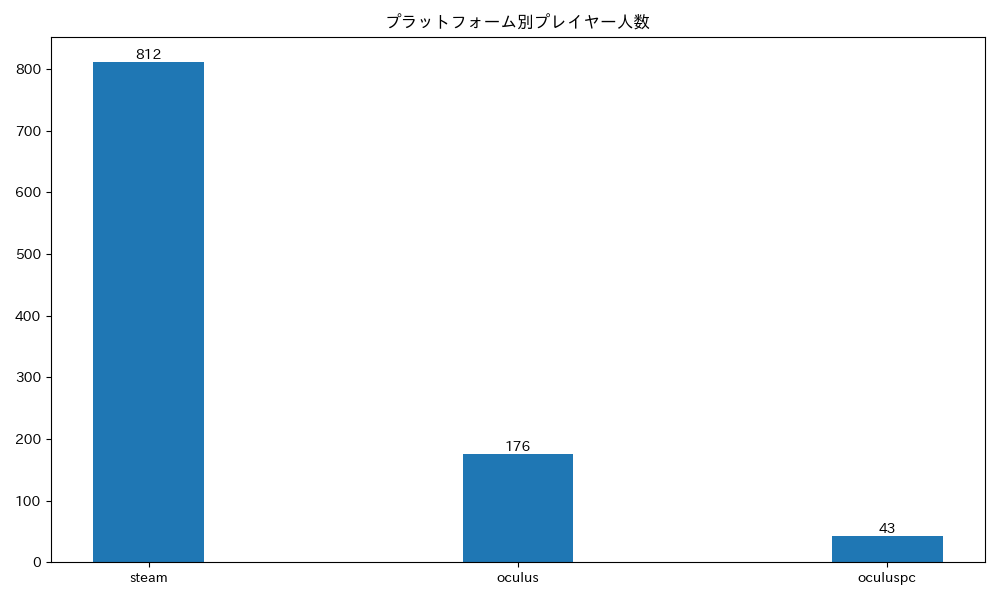
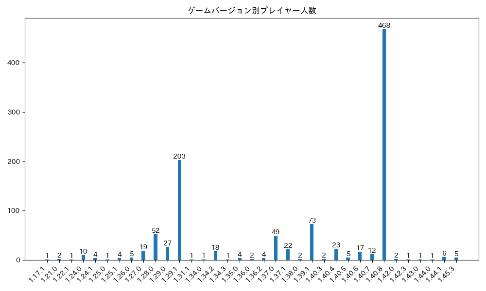
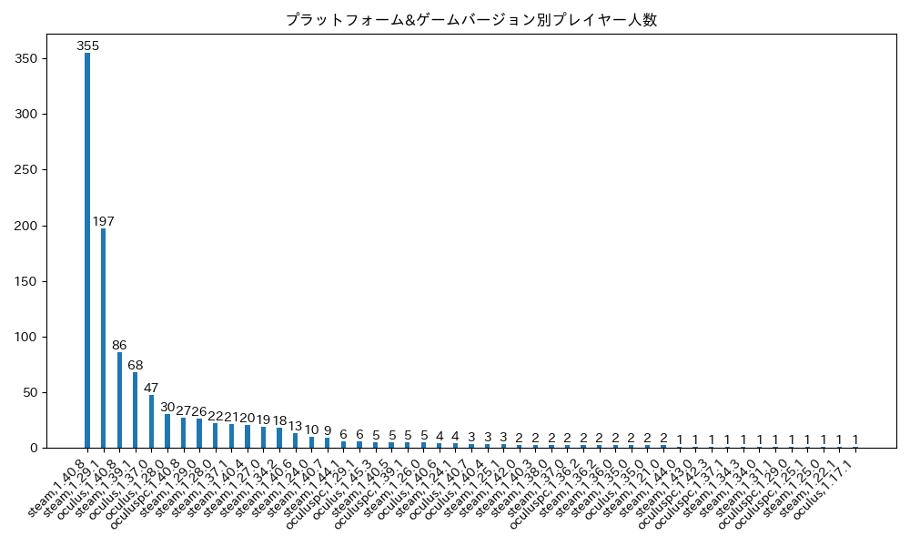

# player_count_by_bs_version

[このポスト](https://x.com/ge2toro/status/1921944149143482563)にインスパイアを受けて作成しました。  
現時点では日本で登録している人を対象に集計しています。  
> [!WARNING]
> BeatLeaderのModを更新していないプレイヤー(BeatLeaderのサイト上でグローバルランクが`#0`となっていたり合計ppが`0pp`になっているプレイヤー。以下「未更新プレイヤー」とします。)の統計は取得できていません。

> [!NOTE]
> 2025年10月15日以降の更新分の集計結果については、gitでバージョン管理されたこのREADMEだけでなく、 https://github.com/rakkyo150/player_count_by_bs_version/blob/master/data/history.json にも保存するようにしました。

## プレイヤーのゲームバージョン統計結果
未更新プレイヤーは0人いました。  
過去1ヶ月以内にプレイがあり、BeatLeaderのModを導入している、未更新プレイヤーを除いた、BeatLeaderに日本で登録しているプレイヤーである1031人が対象。

### プラットフォームのみ
| プラットフォーム | 人数 | 割合 |
| ---- | ---- | ---- |
| steam | 812 | 78.76% |
| oculus | 176 | 17.07% |
| oculuspc | 43 | 4.17% |

### ゲームバージョンのみ
| バージョン | 人数 | 割合 |
| ---- | ---- | ---- |
| 1.45.3 | 1 | 0.1% |
| 1.44.1 | 7 | 0.68% |
| 1.44.0 | 1 | 0.1% |
| 1.43.0 | 1 | 0.1% |
| 1.42.3 | 1 | 0.1% |
| 1.42.0 | 1 | 0.1% |
| 1.40.8 | 467 | 45.3% |
| 1.40.7 | 9 | 0.87% |
| 1.40.6 | 17 | 1.65% |
| 1.40.5 | 5 | 0.48% |
| 1.40.4 | 21 | 2.04% |
| 1.40.3 | 2 | 0.19% |
| 1.39.1 | 73 | 7.08% |
| 1.38.0 | 1 | 0.1% |
| 1.37.2 | 1 | 0.1% |
| 1.37.1 | 20 | 1.94% |
| 1.37.0 | 49 | 4.75% |
| 1.36.2 | 4 | 0.39% |
| 1.36.0 | 2 | 0.19% |
| 1.35.0 | 3 | 0.29% |
| 1.34.3 | 1 | 0.1% |
| 1.34.2 | 20 | 1.94% |
| 1.34.0 | 1 | 0.1% |
| 1.31.1 | 1 | 0.1% |
| 1.29.1 | 199 | 19.3% |
| 1.29.0 | 26 | 2.52% |
| 1.28.0 | 50 | 4.85% |
| 1.27.0 | 18 | 1.75% |
| 1.26.0 | 5 | 0.48% |
| 1.25.1 | 5 | 0.48% |
| 1.25.0 | 1 | 0.1% |
| 1.24.1 | 5 | 0.48% |
| 1.24.0 | 9 | 0.87% |
| 1.22.1 | 1 | 0.1% |
| 1.21.0 | 2 | 0.19% |
| 1.17.1 | 1 | 0.1% |

### HMD
| HMD | 人数 | 割合 |
| ---- | ---- | ---- |
| Quest 3 | 444 | 43.06% |
| Quest 2 | 262 | 25.41% |
| Quest 3S | 108 | 10.48% |
| Valve Index | 43 | 4.17% |
| Pico 4 | 31 | 3.01% |
| Vive | 24 | 2.33% |
| Vive Pro | 20 | 1.94% |
| Rift S | 16 | 1.55% |
| Rift CV1 | 12 | 1.16% |
| Quest | 12 | 1.16% |
| Bigscreen Beyond | 12 | 1.16% |
| PS VR2 | 11 | 1.07% |
| Unknown headset | 9 | 0.87% |
| Steam Frame | 9 | 0.87% |
| Vive Elite | 5 | 0.48% |
| Quest Pro | 4 | 0.39% |
| Vive Pro 2 | 4 | 0.39% |
| Pimax Crystal | 3 | 0.29% |
| Pimax 8K | 1 | 0.1% |
| Vive Cosmos | 1 | 0.1% |

### プラットフォームとゲームバージョンの両方
| プラットフォームとバージョン | 人数 | 割合 |
| ---- | ---- | ---- |
| steam,1.40.8 | 353 | 34.24% |
| steam,1.29.1 | 193 | 18.72% |
| oculus,1.40.8 | 87 | 8.44% |
| steam,1.39.1 | 68 | 6.6% |
| oculus,1.37.0 | 46 | 4.46% |
| oculus,1.28.0 | 32 | 3.1% |
| oculuspc,1.40.8 | 27 | 2.62% |
| steam,1.29.0 | 25 | 2.42% |
| steam,1.37.1 | 20 | 1.94% |
| steam,1.34.2 | 20 | 1.94% |
| steam,1.40.4 | 19 | 1.84% |
| steam,1.28.0 | 18 | 1.75% |
| steam,1.27.0 | 18 | 1.75% |
| steam,1.40.6 | 13 | 1.26% |
| steam,1.24.0 | 9 | 0.87% |
| steam,1.44.1 | 7 | 0.68% |
| steam,1.40.7 | 7 | 0.68% |
| oculuspc,1.29.1 | 6 | 0.58% |
| steam,1.40.5 | 5 | 0.48% |
| oculuspc,1.39.1 | 5 | 0.48% |
| steam,1.26.0 | 5 | 0.48% |
| steam,1.24.1 | 5 | 0.48% |
| oculus,1.40.6 | 4 | 0.39% |
| steam,1.25.1 | 4 | 0.39% |
| steam,1.37.0 | 3 | 0.29% |
| oculus,1.40.7 | 2 | 0.19% |
| oculus,1.40.4 | 2 | 0.19% |
| steam,1.40.3 | 2 | 0.19% |
| oculuspc,1.36.2 | 2 | 0.19% |
| steam,1.36.2 | 2 | 0.19% |
| steam,1.36.0 | 2 | 0.19% |
| steam,1.35.0 | 2 | 0.19% |
| steam,1.21.0 | 2 | 0.19% |
| oculus,1.45.3 | 1 | 0.1% |
| steam,1.44.0 | 1 | 0.1% |
| steam,1.43.0 | 1 | 0.1% |
| oculuspc,1.42.3 | 1 | 0.1% |
| steam,1.42.0 | 1 | 0.1% |
| steam,1.38.0 | 1 | 0.1% |
| steam,1.37.2 | 1 | 0.1% |
| oculus,1.35.0 | 1 | 0.1% |
| steam,1.34.3 | 1 | 0.1% |
| steam,1.34.0 | 1 | 0.1% |
| steam,1.31.1 | 1 | 0.1% |
| oculuspc,1.29.0 | 1 | 0.1% |
| oculuspc,1.25.1 | 1 | 0.1% |
| steam,1.25.0 | 1 | 0.1% |
| steam,1.22.1 | 1 | 0.1% |
| oculus,1.17.1 | 1 | 0.1% |

