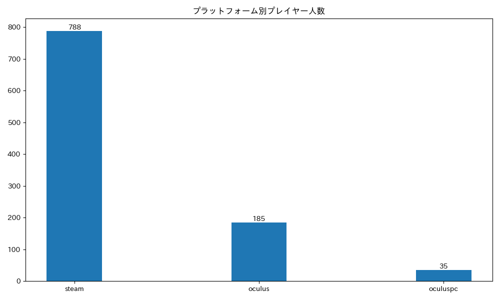

# player_count_by_bs_version

[このポスト](https://x.com/ge2toro/status/1921944149143482563)にインスパイアを受けて作成しました。  
現時点では日本で登録している人を対象に集計しています。  
> [!WARNING]
> BeatLeaderのModを更新していないプレイヤー(BeatLeaderのサイト上でグローバルランクが`#0`となっていたり合計ppが`0pp`になっているプレイヤー。以下「未更新プレイヤー」とします。)の統計は取得できていません。

> [!NOTE]
> 2025年10月15日以降の更新分の集計結果については、gitでバージョン管理されたこのREADMEだけでなく、 https://github.com/rakkyo150/player_count_by_bs_version/blob/master/data/history.json にも保存するようにしました。

## プレイヤーのゲームバージョン統計結果
未更新プレイヤーは177人いました。  
過去1ヶ月以内にプレイがあり、BeatLeaderのModを導入している、未更新プレイヤーを除いた、BeatLeaderに日本で登録しているプレイヤーである1010人が対象。

### プラットフォームのみ
| プラットフォーム | 人数 | 割合 |
| ---- | ---- | ---- |
| steam | 821 | 81.29% |
| oculus | 152 | 15.05% |
| oculuspc | 37 | 3.66% |

### ゲームバージョンのみ
| バージョン | 人数 | 割合 |
| ---- | ---- | ---- |
| 1.40.8 | 230 | 22.77% |
| 1.40.7 | 14 | 1.39% |
| 1.40.6 | 22 | 2.18% |
| 1.40.5 | 12 | 1.19% |
| 1.40.4 | 26 | 2.57% |
| 1.40.3 | 3 | 0.3% |
| 1.39.1 | 105 | 10.4% |
| 1.39.0 | 1 | 0.1% |
| 1.38.0 | 3 | 0.3% |
| 1.37.2 | 1 | 0.1% |
| 1.37.1 | 41 | 4.06% |
| 1.37.0 | 81 | 8.02% |
| 1.36.2 | 4 | 0.4% |
| 1.35.0 | 2 | 0.2% |
| 1.34.3 | 1 | 0.1% |
| 1.34.2 | 23 | 2.28% |
| 1.31.1 | 5 | 0.5% |
| 1.29.1 | 296 | 29.31% |
| 1.29.0 | 24 | 2.38% |
| 1.28.0 | 55 | 5.45% |
| 1.27.0 | 24 | 2.38% |
| 1.26.0 | 8 | 0.79% |
| 1.25.1 | 7 | 0.69% |
| 1.24.1 | 5 | 0.5% |
| 1.24.0 | 9 | 0.89% |
| 1.23.0 | 2 | 0.2% |
| 1.22.1 | 1 | 0.1% |
| 1.21.0 | 2 | 0.2% |
| 1.17.1 | 2 | 0.2% |

### HMD
| HMD | 人数 | 割合 |
| ---- | ---- | ---- |
| Quest 3 | 429 | 42.48% |
| Quest 2 | 295 | 29.21% |
| Quest 3S | 86 | 8.51% |
| Valve Index | 51 | 5.05% |
| Vive Pro | 31 | 3.07% |
| Vive | 27 | 2.67% |
| Pico 4 | 25 | 2.48% |
| Rift S | 17 | 1.68% |
| Quest | 11 | 1.09% |
| Bigscreen Beyond | 9 | 0.89% |
| Quest Pro | 6 | 0.59% |
| PS VR2 | 5 | 0.5% |
| Rift CV1 | 5 | 0.5% |
| Vive Elite | 5 | 0.5% |
| Vive Pro 2 | 3 | 0.3% |
| Windows Mixed Reality | 2 | 0.2% |
| Pimax 8K | 1 | 0.1% |
| Vive Cosmos | 1 | 0.1% |
| Pico Neo 3 | 1 | 0.1% |

### プラットフォームとゲームバージョンの両方
| プラットフォームとバージョン | 人数 | 割合 |
| ---- | ---- | ---- |
| steam,1.29.1 | 290 | 28.71% |
| steam,1.40.8 | 183 | 18.12% |
| steam,1.39.1 | 99 | 9.8% |
| oculus,1.37.0 | 75 | 7.43% |
| steam,1.37.1 | 40 | 3.96% |
| oculus,1.40.8 | 32 | 3.17% |
| oculus,1.28.0 | 31 | 3.07% |
| steam,1.28.0 | 24 | 2.38% |
| steam,1.27.0 | 24 | 2.38% |
| steam,1.34.2 | 23 | 2.28% |
| steam,1.29.0 | 23 | 2.28% |
| steam,1.40.4 | 21 | 2.08% |
| steam,1.40.6 | 16 | 1.58% |
| oculuspc,1.40.8 | 15 | 1.49% |
| steam,1.40.7 | 12 | 1.19% |
| steam,1.40.5 | 11 | 1.09% |
| steam,1.26.0 | 8 | 0.79% |
| steam,1.24.0 | 8 | 0.79% |
| oculuspc,1.39.1 | 6 | 0.59% |
| steam,1.37.0 | 6 | 0.59% |
| oculuspc,1.29.1 | 6 | 0.59% |
| steam,1.25.1 | 6 | 0.59% |
| steam,1.31.1 | 5 | 0.5% |
| steam,1.24.1 | 5 | 0.5% |
| oculus,1.40.6 | 4 | 0.4% |
| oculus,1.40.4 | 3 | 0.3% |
| steam,1.40.3 | 3 | 0.3% |
| steam,1.38.0 | 3 | 0.3% |
| steam,1.36.2 | 3 | 0.3% |
| oculus,1.40.7 | 2 | 0.2% |
| oculuspc,1.40.6 | 2 | 0.2% |
| oculuspc,1.40.4 | 2 | 0.2% |
| oculuspc,1.35.0 | 2 | 0.2% |
| steam,1.23.0 | 2 | 0.2% |
| steam,1.21.0 | 2 | 0.2% |
| oculus,1.17.1 | 2 | 0.2% |
| oculuspc,1.40.5 | 1 | 0.1% |
| steam,1.39.0 | 1 | 0.1% |
| steam,1.37.2 | 1 | 0.1% |
| oculuspc,1.37.1 | 1 | 0.1% |
| oculuspc,1.36.2 | 1 | 0.1% |
| steam,1.34.3 | 1 | 0.1% |
| oculuspc,1.29.0 | 1 | 0.1% |
| oculus,1.25.1 | 1 | 0.1% |
| oculus,1.24.0 | 1 | 0.1% |
| steam,1.22.1 | 1 | 0.1% |
| oculus | 1 | 0.1% |

